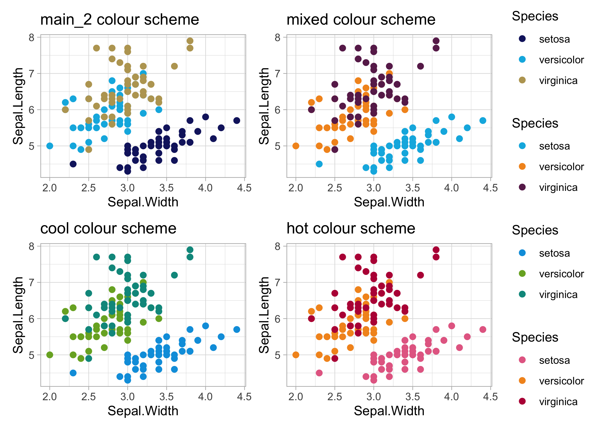

<!-- README.md is generated from README.Rmd. Please edit that file -->

# themeuu 🐦🎨

<!-- badges: start -->

<!-- badges: end -->

The goal of `themeuu` is to provide an easy to use style guide that
adheres to [Ulster University’s branding
criteria](https://www.ulster.ac.uk/__data/assets/pdf_file/0008/391058/UU-Brand-Guidelines-April-2019.pdf).

## Installation

`themeuu` can be installed from [GitHub](https://github.com/) with:

``` r
# install.packages("devtools")
devtools::install_github("Scott-S-Hannah/themeuu")
```

## Example

`themeuu` currently possesses several colour scales that adhere to
[Ulster University’s style
guide](https://www.ulster.ac.uk/__data/assets/pdf_file/0008/391058/UU-Brand-Guidelines-April-2019.pdf).
Other features such as a ggplot2 theme that uses Ulster University’s
typography etc. will be added shortly.

``` r
library(themeuu)
## basic example code
themeuu::ulster_palettes
#> $main_1
#> deep blue  sky blue dark grey 
#> "#151F6D" "#00B5E2" "#5e6d77" 
#> 
#> $main_2
#> deep blue  sky blue      gold 
#> "#151F6D" "#00B5E2" "#bba461" 
#> 
#> $cool
#> bright blue       green        teal 
#>   "#009FDF"   "#78ad2b"   "#00968c" 
#> 
#> $hot
#>          pink bright orange           red 
#>     "#e56c92"     "#f39521"     "#b90745" 
#> 
#> $mixed
#>      sky blue bright orange        purple 
#>     "#00B5E2"     "#f39521"     "#692759" 
#> 
#> $grey
#>      black light grey  dark grey 
#>  "#000000"  "#c6d1d6"  "#5e6d77"
```

Here is an example of the `scale_color_ulster()` function with the
default colour scheme:


`themeuu` possess several colour schemes:

