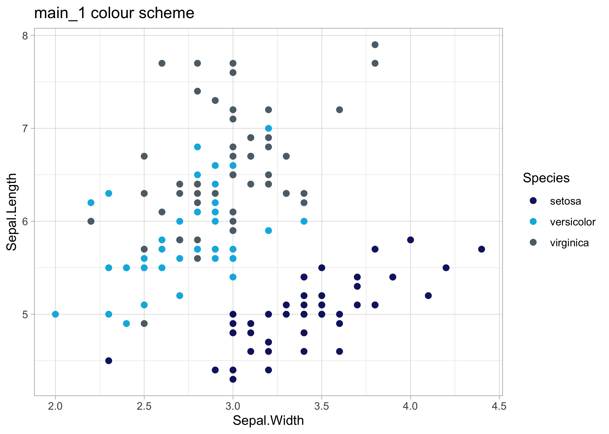

<!-- README.md is generated from README.Rmd. Please edit that file -->

# themeuu 🐦🎨

<!-- badges: start -->

<!-- badges: end -->

The goal of `themeuu` is to provide a easy style guide that adheres to
[Ulster University’s branding
criteria](https://www.ulster.ac.uk/__data/assets/pdf_file/0008/391058/UU-Brand-Guidelines-April-2019.pdf).

## Installation

`themeuu` can be installed from [GitHub](https://github.com/) with:

``` r
# install.packages("devtools")
devtools::install_github("Scott-S-Hannah/themeuu")
```

## Example

`themeuu` possesses several colour scales that adhere to [Ulster
University’s style
guide](https://www.ulster.ac.uk/__data/assets/pdf_file/0008/391058/UU-Brand-Guidelines-April-2019.pdf).

``` r
library(themeuu)
## basic example code
themeuu::ulster_palettes
#> $main_1
#> deep blue  sky blue dark grey 
#> "#151F6D" "#00B5E2" "#5e6d77" 
#> 
#> $main_2
#> deep blue  sky blue      gold 
#> "#151F6D" "#00B5E2" "#bba461" 
#> 
#> $cool
#> bright blue       green        teal 
#>   "#009FDF"   "#78ad2b"   "#00968c" 
#> 
#> $hot
#>          pink bright orange           red 
#>     "#e56c92"     "#f39521"     "#b90745" 
#> 
#> $mixed
#>      sky blue bright orange        purple 
#>     "#00B5E2"     "#f39521"     "#692759" 
#> 
#> $grey
#>      black light grey  dark grey 
#>  "#000000"  "#c6d1d6"  "#5e6d77"
```

Here is an example of the `scale_color_ulster()` function with the
default colour scheme:



`themeuu` possess several colour schemes:

``` r
p1 <- ggplot(iris, aes(x = Sepal.Width, Sepal.Length, colour = Species)) +
  geom_point(size = 2) +
  scale_color_ulster(discrete = TRUE, palette = "main_2") +
  theme_light() +
  labs(title = "main_2 colour scheme")

p2 <- ggplot(iris, aes(x = Sepal.Width, Sepal.Length, colour = Species)) +
  geom_point(size = 2) +
  scale_color_ulster(discrete = TRUE, palette = "mixed") +
  theme_light() +
  labs(title = "mixed colour scheme")

p3 <- ggplot(iris, aes(x = Sepal.Width, Sepal.Length, colour = Species)) +
  geom_point(size = 2) +
  scale_color_ulster(discrete = TRUE, palette = "cool") +
  theme_light() +
  labs(title = "cool colour scheme")

p4 <- ggplot(iris, aes(x = Sepal.Width, Sepal.Length, colour = Species)) +
  geom_point(size = 2) +
  scale_color_ulster(discrete = TRUE, palette = "hot") +
  theme_light() +
  labs(title = "hot colour scheme")

library(patchwork)
p1 + p2 + p3 + p4 +
  patchwork::plot_layout(guides = "collect")
```


